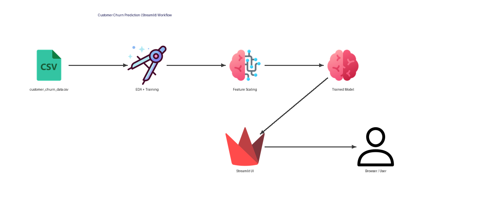

# Customer Churn Prediction (Streamlit)

This project predicts customer churn using machine learning models and serves predictions through a Streamlit web app.

## 🚀 Workflow
1. Data (customer_churn_data.csv)
2. Data exploration & preprocessing (`notebook.ipynb`)
3. Feature scaling (`scaler.pkl`)
4. Model training & export (`model.pkl`)
5. Interactive UI using Streamlit (`app.py`)
6. Architecture diagram (`churn_architecture_streamlit.png`)

## 📸 Architecture


## 🔧 Installation
```bash
git clone https://github.com/ahmeraftab/Customer-Churn-Prediction.git
cd Customer-Churn-Prediction
pip install -r requirements.txt

